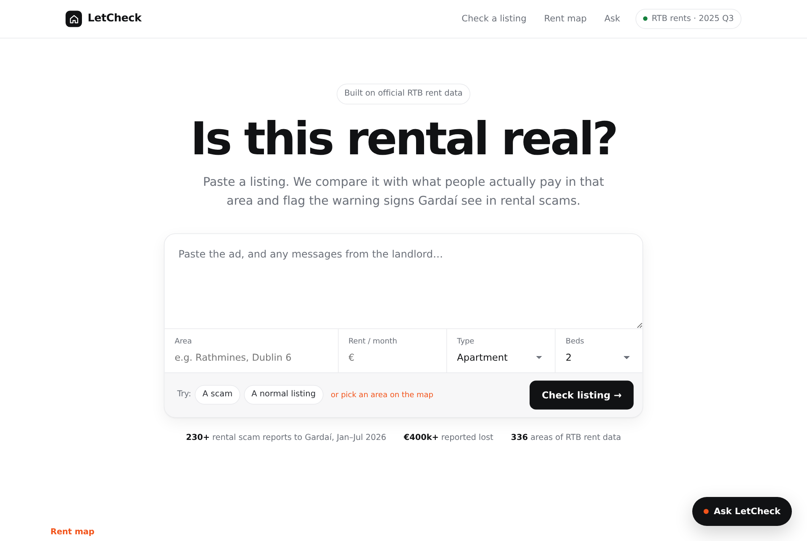
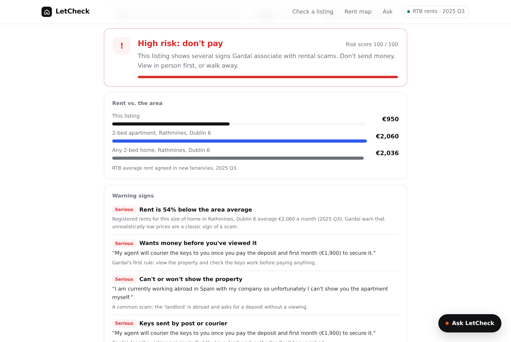
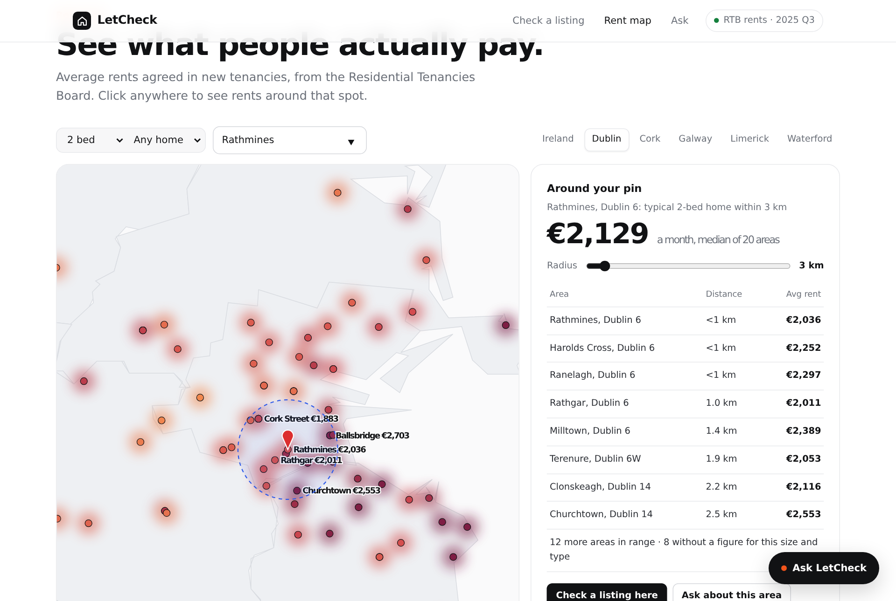

# LetCheck

**Check a rental listing against the rents people actually pay, before you send any money.**

LetCheck helps renters in Ireland spot rental scams. Paste an ad and it compares the rent with official Residential Tenancies Board (RTB) figures for that area, highlights the warning signs Gardaí see in rental scams, and tells you what to do next. It also has a rent heatmap, an AI assistant, and an MCP server so any AI agent can use the same data.

Built in one day at **Build for Ireland** (OpenAI × Give(a)Go × Dogpatch Labs), Dublin, 4 October 2026.

> Gardaí received over 230 reports of rental and reservation scams in the first seven months of 2026, with reported losses of over €400,000. Their advice: view in person, check the keys work, and compare the price with the RTB rent index. LetCheck does those checks in seconds.

**Live demo:** `https://aarush310.github.io/letcheck/web/` *(once GitHub Pages is on, see below)*



| Check a listing | Rents around a pin |
|---|---|
|  |  |

---

## Features

- **Listing checker.** Paste the ad and the "landlord's" messages. LetCheck:
  - compares the rent with the RTB average for that area, bedroom count and property type (40%+ below average is a serious warning);
  - finds Garda warning signs in the text (pay before viewing, landlord abroad, keys by post, untraceable payment, pressure, WhatsApp-only, ID documents up front) and quotes the exact sentence;
  - gives a clear verdict, the Garda checklist, and questions to send the advertiser.
- **Rent heatmap.** Ireland coloured by average rent, with zoom presets for Dublin, Cork, Galway, Limerick and Waterford. Click anywhere to see the typical rent within a radius you choose and a table of nearby areas.
- **AI assistant** (the "Ask LetCheck" button). Ask about rents or a listing. Every figure comes from a tool call, never from the model's memory, and each answer says which quarter the data is from.
- **AI second opinion.** An optional model check of the listing text. Any flag whose quote doesn't appear word for word in the listing is discarded.
- **MCP server.** The same data and checks as tools for ChatGPT, Claude Desktop, Codex, Cursor or the OpenAI Agents SDK.
- **Private by default.** Nothing a renter pastes is stored or sent anywhere unless they ask for an AI check.

## Quick start

### Web app
No build step. Open `web/index.html` in a browser; the rent data is embedded.

The in-page assistant and AI second opinion run when the page is opened inside a Claude artifact viewer. Everywhere else (local file, GitHub Pages) those two buttons hide themselves and the checker and map work fully.

### MCP server
```bash
pip install "mcp[cli]"
python mcp_server/server.py                      # stdio
python mcp_server/server.py --http --port 8000   # streamable HTTP at http://localhost:8000/mcp
```

| Tool | What it does |
|---|---|
| `find_areas(query)` | Search RTB area names (towns, Dublin neighbourhoods, counties) |
| `area_rents(area)` | All average rents for an area by bedrooms and property type |
| `rents_near(area or lat/lon, radius_km, beds, property_type)` | Nearby areas with rents and the median |
| `check_listing(text, price_eur, area, beds, kind)` | Scam score, flags with quoted evidence, price benchmark |
| `data_info()` | Data source and latest quarter |

**Claude Desktop** (`claude_desktop_config.json`):
```json
{ "mcpServers": { "letcheck": { "command": "python", "args": ["/absolute/path/to/mcp_server/server.py"] } } }
```
**ChatGPT / OpenAI Responses API:** run the HTTP mode behind a public HTTPS URL (for example a tunnel) and add it as a remote MCP server.

### OpenAI assistant (Agents SDK + MCP)
```bash
pip install openai-agents "mcp[cli]"
export OPENAI_API_KEY=...        # never commit keys
python mcp_server/assistant_openai.py "Is €950 for a 2-bed apartment in Rathmines a scam risk?"
```
Set `OPENAI_MODEL` to choose a model.

### Refresh to the newest RTB quarter
```bash
python fetch_rtb.py      # downloads CSO table RIQ02, keeps the latest figure per area -> rtb_latest.csv
python update_data.py    # updates mcp_server/letcheck_data.json
```
For the web app, drop `rtb_latest.csv` into the data panel ("About the rent data").

## How it works

```
data.gov.ie / CSO RIQ02 ─► fetch_rtb.py ─► letcheck_data.json (rents + area positions)
                                              │
              ┌───────────────────────────────┼─────────────────────────────┐
              ▼                               ▼                             ▼
   Web app: checker, heatmap,         MCP server (5 tools)         In-page assistant
   rents around a pin                 ▲          ▲                 (page functions as tools)
                                      │          │
                      OpenAI Agents SDK      Claude Desktop / Codex / ChatGPT
```

The price check and warning-sign rules are plain code. AI only reads text and calls tools; it never produces a rent figure itself.

## Data

| Data | Source | Licence |
|---|---|---|
| Average monthly rents by area, bedrooms and property type | RTB Average Monthly Rent Report, CSO table RIQ02, listed on data.gov.ie | CC-BY 4.0 |
| County outlines | [jonnymccullagh/ireland-counties-geojson](https://github.com/jonnymccullagh/ireland-counties-geojson) | see repo |
| Area positions | GeoNames-derived place data ([lutangar/cities.json](https://github.com/lutangar/cities.json)) plus Dublin postal-district centres | see repo |
| Scam warning signs and figures | An Garda Síochána, August 2026 (provisional figures) | public statement |

The embedded snapshot runs to **2025 Q3**. It was taken from a public mirror of the RIQ02 extract ([SiddarthSharma1308/ireland-housing-crisis-analysis](https://github.com/SiddarthSharma1308/ireland-housing-crisis-analysis)); run the refresh scripts above to use the newest official quarter.

**Why no live listings?** Sites like Daft don't offer an open licence for their listings and their terms don't allow scraping. A safety tool shouldn't depend on data it isn't allowed to use.

## Limitations

- A clean result isn't proof a listing is genuine. Always view in person and check the keys work before paying.
- RTB figures are rents agreed in new tenancies, which are usually lower than asking prices. A listing far *below* the RTB average is therefore a strong warning.
- The RTB publishes no figures for rooms in shared homes, so LetCheck doesn't price-check rooms.
- The RTB withholds figures for small samples, so some areas lack some sizes or types.
- Map positions are approximate area centres; some Dublin neighbourhoods use their postal district's centre.

## Project structure

```
web/index.html                 web app (data embedded)
mcp_server/server.py           MCP server
mcp_server/assistant_openai.py OpenAI Agents SDK assistant using the MCP server
mcp_server/letcheck_data.json  rents + area positions
fetch_rtb.py                   download newest RIQ02 data
update_data.py                 refresh the MCP server's data
docs/                          screenshots
```

## Team

[Team names and GitHub handles]

## Licence

Code: MIT (see `LICENSE`). Data remains under its original licences listed above; RTB/CSO data is CC-BY 4.0 and must be credited.

*LetCheck gives warning signs, not a guarantee. If you think you've been scammed, contact your local Garda station and your bank.*
