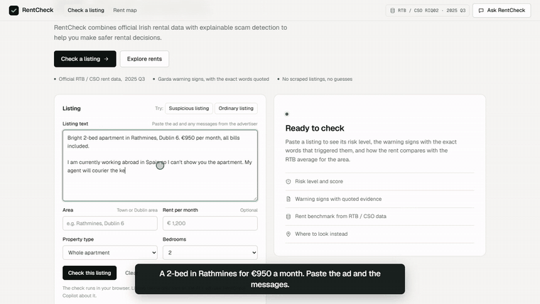
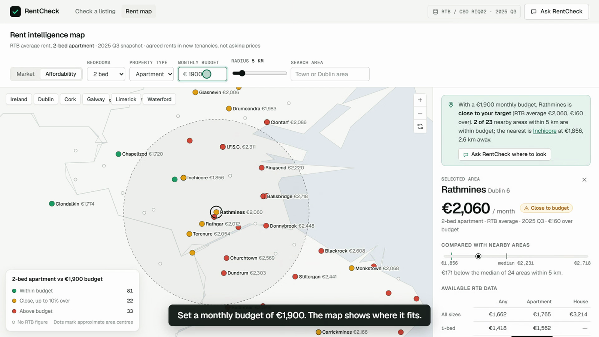
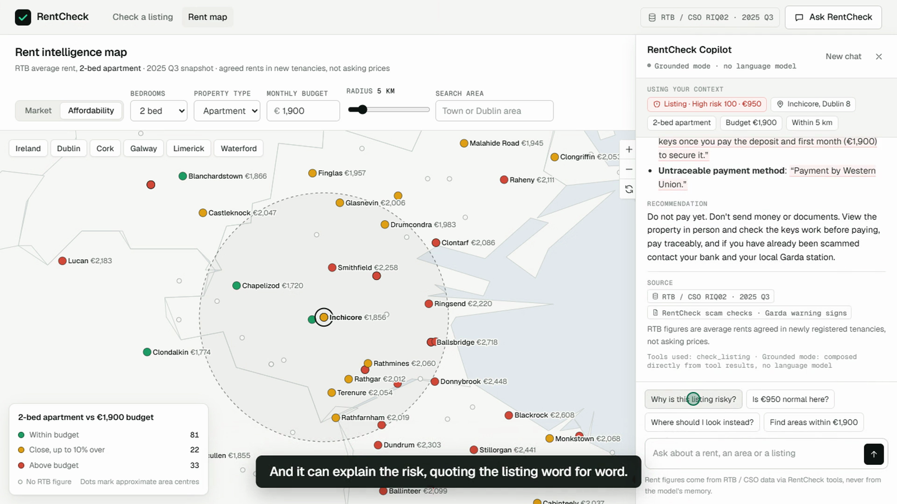
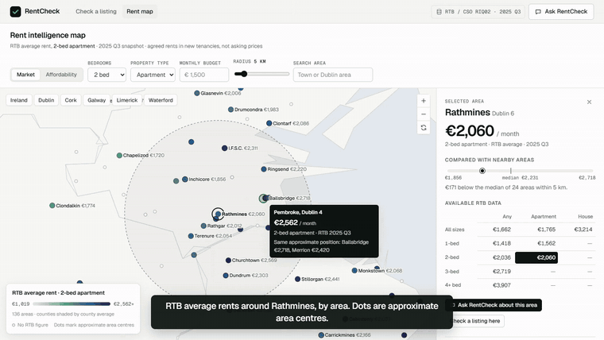
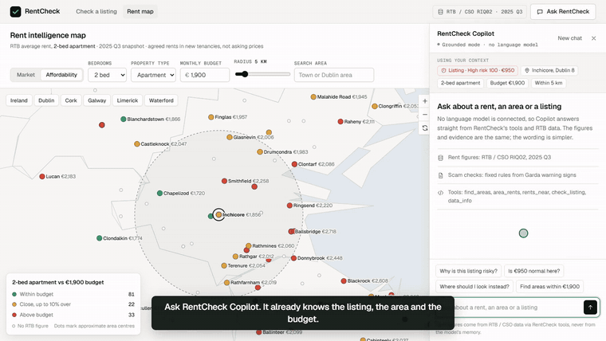

<div align="center">

# 🏠 RentCheck

### Know the rent. Spot the risk. Rent smarter.

Safer rental decisions in Ireland: official RTB rent data, rental-scam warning signs,<br/>
a rent map with an affordability mode, and an AI Copilot that shows its sources.

<p>
  
  
  
  
  
  
</p>

**Built in one day at Build for Ireland** (OpenAI × Give(a)Go × Dogpatch Labs, Dublin AI Week)<br/>
Dogpatch Labs, Dublin · 4 October 2026

<br/>

<a href="demo/rentcheck-demo.mp4">
  
</a>

**[▶ Watch the full 90-second demo](demo/rentcheck-demo.mp4)**

</div>

---

## The problem

Rental scams are rising in Ireland. Gardaí reported **230+ cases and €400,000+ lost** between January and July 2026. Renters under pressure in a tight market see a listing that looks too good to be true, and have no quick way to check it before they send money.

RentCheck answers three questions in seconds:

| | |
|---|---|
| 🚩 **Is this listing suspicious?** | Deterministic checks based on Garda warning signs, highlighting the exact words that triggered each one. |
| 💶 **Is the rent reasonable?** | The asking rent against the RTB average for the same area, size and property type, with the quarter shown. |
| 🗺️ **Where should I look instead?** | A rent map with a budget mode, nearby alternatives, and a Copilot that reasons over the same data. |

## See it in action

<table>
  <tr>
    <td width="50%"><br/><sub><b>Spot the risk.</b> Every warning sign is quoted from the ad, and the rent is compared with the RTB benchmark.</sub></td>
    <td width="50%"><br/><sub><b>Know the rent.</b> RTB averages around the area. Dots are approximate area centres.</sub></td>
  </tr>
  <tr>
    <td><br/><sub><b>Budget mode.</b> Areas within, close to, or above your monthly budget.</sub></td>
    <td><br/><sub><b>Ask the Copilot.</b> Answers come from RentCheck's tools and RTB data, with sources shown.</sub></td>
  </tr>
</table>

<details>
<summary><b>More demo clips</b></summary>
<br/>
<p><b>Rent map and budget mode</b><br/></p>
<p><b>Copilot over MCP</b><br/></p>
</details>

## Run

```bash
pip install -r requirements.txt
cp .env.example .env          # optional: add OPENAI_API_KEY for the AI Copilot
python run.py                 # http://127.0.0.1:8787
```

No key, or no install? Everything still works. `web/index.html` also opens straight from disk. In both cases
Copilot runs in **grounded mode**: no language model, answers composed directly from the same tools and data.
The "Data and system status" dialog (data chip, top right) shows which mode is live.

```bash
python mcp_server/server.py                    # MCP over stdio: Claude Desktop, Codex, Cursor, Agents SDK
python mcp_server/server.py --http --port 8000 # MCP over streamable HTTP at /mcp
python mcp_server/assistant_openai.py "Is €950 for a 2-bed apartment in Rathmines a scam risk?"   # Copilot from the CLI
python tests/test_parity.py                    # Python tools and their browser port return identical results
```

Claude Desktop config: `{"mcpServers": {"rentcheck": {"command": "python", "args": ["/path/to/mcp_server/server.py"]}}}`.

## Demo flow

1. On the home page click **Suspicious listing** (or paste one). The check runs instantly in the browser.
2. The result shows the risk score, each warning sign with the exact sentence highlighted in the listing, and the asking rent against the RTB benchmark.
3. Click **Explore this area**. The map opens focused on the area with its RTB figures and nearby areas.
4. Type a **monthly budget** (e.g. 1,900). The map switches to affordability: within budget, close (up to 10% over), above.
5. Click **Ask RentCheck where to look** (or open Copilot and ask "Where should I look instead?").
6. Copilot calls `rents_near` with your area, size and budget and returns a table of alternatives. **View on map** opens any of them.

## Architecture

```
            web app (web/)                                   any MCP client
  checker · rent map · Copilot panel                (Claude Desktop, Codex, Cursor, ChatGPT)
        │ instant, offline            │ /api/chat (SSE)              │
        ▼                             ▼                              │
  web/js/core.js              backend/agent.py                       │
  JS port of the tools        RentCheck Copilot (OpenAI Agents SDK)   │
  (grounded mode)                     │ MCP (stdio)                  │
        │                             ▼                              ▼
        │                     mcp_server/server.py  ── find_areas · area_rents · rents_near · check_listing · data_info
        │                             │
        ▼                             ▼
  web/data/rentcheck-data.js  ◄── update_data.py ◄── mcp_server/core.py  (rent lookups + deterministic scam checks)
                                                    mcp_server/rentcheck_data.json  (RTB / CSO RIQ02 snapshot + area positions)
                                                    mcp_server/scam_rules.json     (Garda warning-sign rules)
```

| Layer | Where | Notes |
|---|---|---|
| UI | `web/index.html`, `web/css/app.css`, `web/js/{checker,map,copilot,app,ui}.js` | No build step. Shared state (area, beds, type, budget, radius, listing) connects the checker, the map and Copilot. |
| Data layer | `mcp_server/core.py`, `web/js/core.js` | One rules file and one data file feed both. `tests/test_parity.py` checks the two implementations agree. |
| MCP tools | `mcp_server/server.py` | Five tools. `rents_near` takes an optional `budget_eur` and `sort` (`closest`, `cheapest`, `best_fit`). |
| AI layer | `backend/agent.py`, `web/js/copilot-service.js` | One agent. The browser never talks to a model directly. |
| Configuration | `backend/config.py`, `.env`, `web/js/config.js` | The API key lives only in the environment / `.env` (git-ignored). Nothing secret is in the frontend. |

### How the AI is kept honest

- **Every rent figure comes from a tool call.** The agent's instructions forbid figures from memory; the UI's "Key figures" cards are rendered from the tool results themselves, not from model text.
- **Figure check.** After each AI answer the backend compares every euro amount in the text with the tool results and the user's own numbers, and the UI flags anything it can't trace.
- **Evidence is quoted, never generated.** Quotes come from `check_listing`, which returns literal slices of the listing. The optional AI second opinion is filtered twice (server and browser) to quotes that appear word for word.
- **Sources on every answer.** `RTB / CSO RIQ02 · <quarter>` for figures, `RentCheck scam checks · Garda warning signs` for rules, plus the list of tools used and whether a model wrote the wording.
- **Context is passed, not re-asked.** Selected area, bedrooms, property type, budget, radius, and the checked listing with its score go to the agent with each question.

## Data

- **Rents:** RTB Average Monthly Rent Report, CSO table RIQ02, listed on data.gov.ie (CC-BY 4.0). Average rents agreed in **newly registered tenancies**, by area (towns, Dublin neighbourhoods and counties), bedrooms and property type. **These are not asking prices.** The stored snapshot runs to **2025 Q3**, taken from a public mirror of the RIQ02 extract (github.com/SiddarthSharma1308/ireland-housing-crisis-analysis). It is a snapshot, not a live feed.
- **Refresh:** `python fetch_rtb.py` then `python update_data.py` updates the MCP server and the web bundle together. Or drop the CSV into the "Data and system status" dialog to update one browser.
- **Map:** county outlines from open GeoJSON (jonnymccullagh/ireland-counties-geojson); area positions from GeoNames-derived place data plus Dublin postal-district centres. Positions are approximate area centres, not boundaries, and several areas can share one centre. The map says so.
- **Not used:** live listings from Daft or similar. They don't offer an open listings licence and their terms don't allow scraping, so a safety tool shouldn't depend on them.
- **Scam rules and advice:** An Garda Síochána, August 2026 (230+ reports and €400,000+ losses, Jan–Jul 2026; provisional).

## Limits

- A clean result is not proof a listing is genuine. Always view in person, check the keys work, and pay traceably. If already scammed, contact your bank and local Garda station.
- RTB figures are agreed rents, usually below asking prices, so a listing far below the RTB average is a strong warning and "within budget" on the map is a floor, not a promise.
- No RTB figures exist for rooms in shared homes, and the RTB withholds small samples, so some areas lack some sizes.
- Grounded mode understands a fixed set of questions (area rents, budget search, comparisons, price checks, listing risk, data questions). Free-form questions need the AI mode.

## Team

Built at **Build for Ireland**, Dublin AI Week, by:

| Aarush Prasad | Jenil Parmar | Dheeraj Chavan |
|:---:|:---:|:---:|

## Thanks

To **OpenAI**, **Give(a)Go** and **Dogpatch Labs** for running Build for Ireland, and to **Dublin AI Week** for the wider programme.

## Credits

RTB / CSO (RIQ02, CC-BY 4.0) via data.gov.ie; county outlines: github.com/jonnymccullagh/ireland-counties-geojson; place positions: GeoNames-derived data (github.com/lutangar/cities.json); scam advice: An Garda Síochána.

Never commit API keys: put `OPENAI_API_KEY` in your environment or `.env` (ignored by git).
